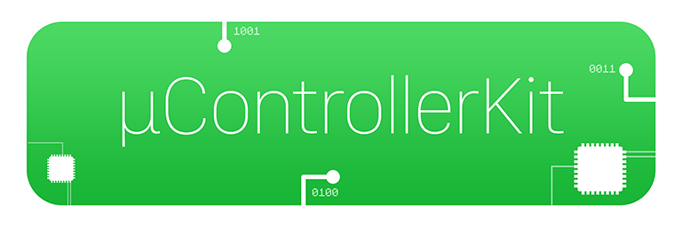
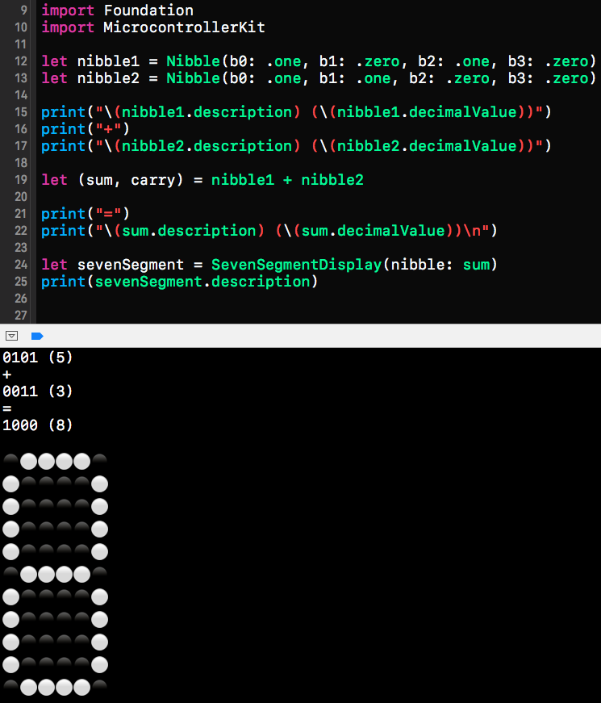

## About
MicrocontrollerKit is a Swift framework containing basic value types, operators and functions for tinkering with microcontrollers in software.

### Seven-segment display
In the macOS example, 2 nibbles are created and added. Its sum is given to a `SevenSegmentDisplay`, which has a textual representation using emoticons.

## Requirements
* Xcode 8.3+

## License

This project is available under the MIT license. See the LICENSE file for more info.
